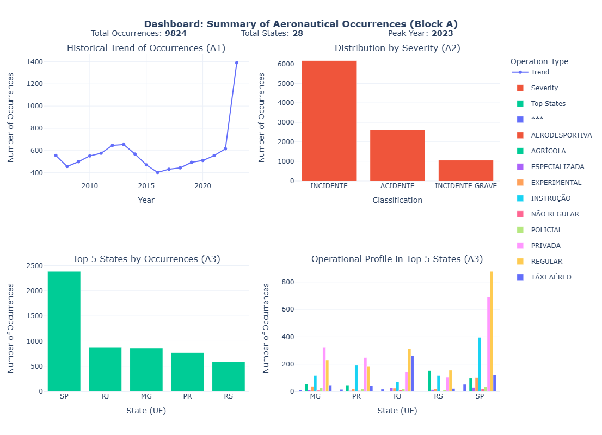
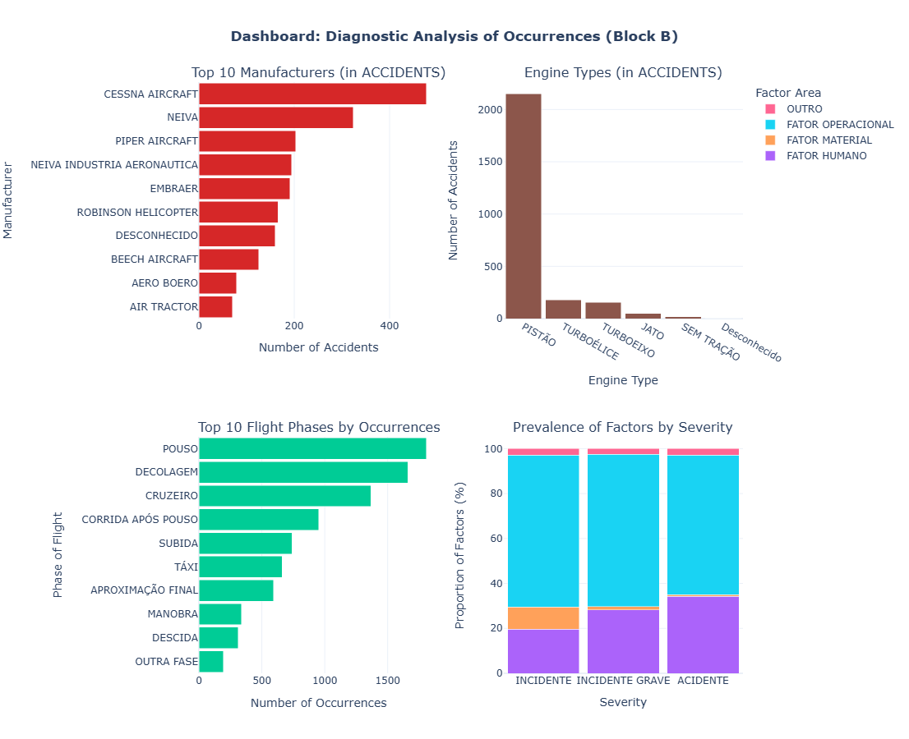

# Analysis of Aeronautical Occurrences in Brazilian Civil Aviation

An in-depth exploratory and diagnostic data analysis of aeronautical occurrences in Brazil, using the public dataset provided by CENIPA.

---

## 📋 Table of Contents
* [Business Problem](#%EF%B8%8F-business-problem)
* [Tech Stack](#-tech-stack)
* [Project Structure](#-project-structure)
* [Key Findings & Dashboards](#-key-findings--dashboards)
* [Author](#-author)

---

### Business Problem
A civil aviation regulatory body needs to optimize the allocation of its resources (inspection teams, training programs, prevention campaigns) to reduce the number and severity of aeronautical occurrences. This project aims to investigate the historical data of occurrences to provide a clear diagnosis of the main points of concern in Brazilian civil aviation, answering key questions that will guide the agency's strategic decision-making.

The analysis is structured to answer the following key questions:
* **Block A (Descriptive):** What are the trends, severity, and geographical/seasonal patterns of occurrences?
* **Block B (Diagnostic):** Which aircraft profiles, types of operation, contributing factors, and flight phases are most associated with risk?

---

### 🛠️ Tech Stack
* **Language:** Python 3.9+
* **Libraries for Data Analysis:** Pandas, NumPy, Pandasql
* **Libraries for Data Visualization:** Matplotlib, Seaborn, Plotly
* **Environment:** Jupyter Notebook

---

### 📂 Project Structure
* `Visualization_of_aeronautical_occurrences.ipynb`: The main Jupyter Notebook containing the entire analysis, from data cleaning to the final recommendations.
* `images/`: Folder containing the dashboard images displayed below.
* `README.md`: This file, providing an overview of the project.

---

### 📊 Key Findings & Dashboards

The analysis yielded several actionable insights, with the main conclusion being that a "one-size-fits-all" approach to safety is inefficient. The highest risk is concentrated in the **General Aviation sector**, where the **Human Factor** is the primary driver of severe accidents, especially during **takeoff and landing**.

Below are the interactive dashboards created to summarize the findings of each analysis block.

#### Block A Dashboard: Descriptive Overview

#### Block B Dashboard: Diagnostic Analysis

---

### 👨‍💻 Author

* **Enzo Parra Vesguerber**
* **LinkedIn:** [https://www.linkedin.com/in/enzoparrav](https://www.linkedin.com/in/enzoparrav)
